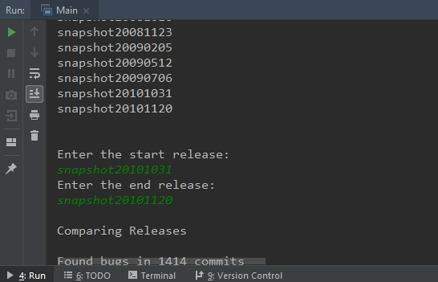

# Bug Reporting System

## System Requirements

1. Windows
2. JDK
3. Gradle
4. Intellij IDEA

## How to open project

Import as Gradle Project in Intellij IDEA

## How to run

With project open in Intellij IDEA, open Main.class file and click on the green run icon present just left of the class file name and then chose to run.

## After running

1. Clone any git java code repository.

E.g. guava, guice, gson from google or any platfrom_packages from aosp-mirror.

2. Enter local path of cloned repo in console

3. After a while, the list of releases are printed out.

4. Chose any 2 releases from list, and enter them as start and end release.

5. The report will be generated in the form of csv file.

6. The CSV file is generated.

Note: It may take some time for large code bases. Be patient.